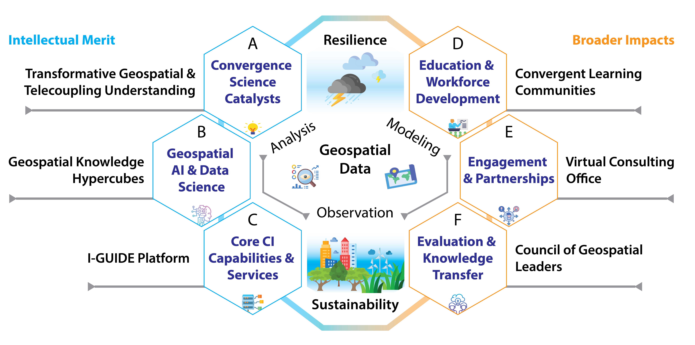
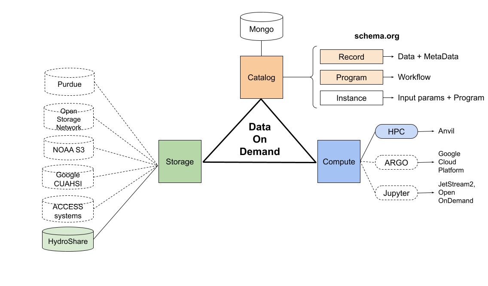

# I-GUIDE
The Institute for Geospatial Understanding through an Integrative Discovery Environment (I-GUIDE) is an interdisciplinary intercollegiate institute supported by the National Science Foundation that brings together people who are working on a wide variety of geospatial problems. I-GUIDE combines geospatial-related expertises and resources to achieve things that couldn’t be done individually.

# I-GUIDE Platform Architecture
